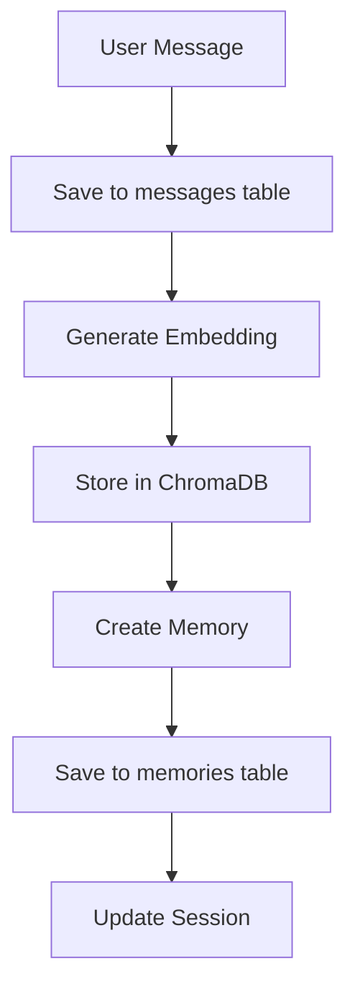

# 🗄️ Database Setup Guide - LongContext Agent

## 📊 **Database Architecture Overview**

This project uses a **hybrid database architecture** combining two databases:

### 1. **SQLite** (Structured Data)
- **Purpose**: Stores structured data like sessions, messages, metrics, tool calls
- **File**: `memory.db` (auto-created)
- **Location**: `backend/memory.db`

### 2. **ChromaDB** (Vector Storage)  
- **Purpose**: Stores vector embeddings for semantic memory search
- **Directory**: `vector_db/` (auto-created)
- **Location**: `backend/vector_db/`

## 🚀 **Quick Setup (Automatic)**

### ✅ **The Good News: Zero Manual Setup Required!**

The databases are **automatically initialized** when you start the backend:

```powershell
cd backend
.\activate.ps1           # Activate virtual environment
python start.py          # Start backend (auto-creates databases)
```

**What happens automatically:**
1. ✅ SQLite database (`memory.db`) is created with all tables
2. ✅ ChromaDB directory (`vector_db/`) is initialized  
3. ✅ All necessary tables and indexes are set up
4. ✅ Vector collections are created for embeddings

## 📋 **Database Schema Details**

### **SQLite Tables** (Automatically Created)

#### 1. **sessions** - Conversation Sessions
```sql
CREATE TABLE sessions (
    id TEXT PRIMARY KEY,                    -- Unique session ID
    title TEXT NOT NULL,                    -- Session title
    created_at TIMESTAMP DEFAULT CURRENT_TIMESTAMP,
    updated_at TIMESTAMP DEFAULT CURRENT_TIMESTAMP,
    metadata TEXT DEFAULT '{}'              -- JSON metadata
);
```

#### 2. **messages** - Chat Messages
```sql
CREATE TABLE messages (
    id TEXT PRIMARY KEY,                    -- Message ID
    session_id TEXT NOT NULL,              -- Links to sessions
    role TEXT NOT NULL,                     -- 'user', 'assistant', 'system'
    content TEXT NOT NULL,                  -- Message content
    timestamp TIMESTAMP DEFAULT CURRENT_TIMESTAMP,
    metadata TEXT DEFAULT '{}',             -- JSON metadata
    FOREIGN KEY (session_id) REFERENCES sessions (id) ON DELETE CASCADE
);
```

#### 3. **memories** - AI Memory Storage
```sql
CREATE TABLE memories (
    id TEXT PRIMARY KEY,                    -- Memory ID
    session_id TEXT NOT NULL,              -- Links to sessions
    memory_type TEXT NOT NULL,             -- 'conversation', 'summary', etc.
    content TEXT NOT NULL,                  -- Memory content
    relevance_score REAL DEFAULT 0.0,      -- Relevance scoring
    compression_ratio REAL DEFAULT 1.0,    -- Compression efficiency
    token_count INTEGER DEFAULT 0,         -- Token usage tracking
    timestamp TIMESTAMP DEFAULT CURRENT_TIMESTAMP,
    metadata TEXT DEFAULT '{}',
    FOREIGN KEY (session_id) REFERENCES sessions (id) ON DELETE CASCADE
);
```

#### 4. **metrics** - Performance Metrics
```sql
CREATE TABLE metrics (
    id INTEGER PRIMARY KEY AUTOINCREMENT,
    metric_name TEXT NOT NULL,             -- Metric type
    metric_value REAL NOT NULL,            -- Metric value
    timestamp TIMESTAMP DEFAULT CURRENT_TIMESTAMP,
    metadata TEXT DEFAULT '{}'
);
```

#### 5. **tool_calls** - Tool Execution History
```sql
CREATE TABLE tool_calls (
    id TEXT PRIMARY KEY,                    -- Call ID
    session_id TEXT NOT NULL,              -- Links to sessions
    tool_type TEXT NOT NULL,               -- 'calculator', 'web_search', etc.
    parameters TEXT NOT NULL,              -- JSON parameters
    result TEXT,                           -- Tool execution result
    execution_time_ms REAL DEFAULT 0.0,   -- Performance tracking
    timestamp TIMESTAMP DEFAULT CURRENT_TIMESTAMP,
    FOREIGN KEY (session_id) REFERENCES sessions (id) ON DELETE CASCADE
);
```

### **ChromaDB Collections** (Automatically Created)

#### **memories** Collection
- **Purpose**: Vector storage for semantic similarity search
- **Embedding Model**: OpenAI `text-embedding-ada-002` (1536 dimensions)
- **Distance Metric**: Cosine similarity
- **Metadata**: session_id, memory_type, relevance_score, timestamp

## 🛠️ **Environment Configuration**

### **Required Settings** in `.env`:

```env
# Database Configuration
DATABASE_URL=sqlite:///./memory.db      # SQLite database path
VECTOR_DIMENSION=1536                   # OpenAI embedding dimensions
BATCH_SIZE=100                          # Query batch size

# OpenAI (Required for embeddings)
OPENAI_API_KEY=your-actual-api-key-here
```

### **Setup Your Environment:**

1. **Copy environment template:**
   ```powershell
   cd backend
   copy .env.example .env
   ```

2. **Add your OpenAI API key:**
   ```powershell
   notepad .env    # Edit and add your API key
   ```

3. **Important**: Replace the placeholder API key with your real one!

## 🔍 **Database File Locations**

After running the backend, you'll see these files:

```
backend/
├── memory.db              # ← SQLite database file
├── vector_db/             # ← ChromaDB directory
│   ├── chroma.sqlite3     # ChromaDB metadata
│   └── [various data files]
├── .env                   # Your config (not in git)
└── longcontext_agent.log  # Application logs
```

## 🧪 **Verify Database Setup**

### **Check Database Health:**
Visit: http://localhost:8000/health

**Healthy Response:**
```json
{
  "status": "healthy",
  "timestamp": "2025-10-13T14:58:00Z",
  "database_connected": true,
  "vector_db_connected": true,
  "openai_api_available": true
}
```

### **Explore Database Tables:**

#### **Option 1: SQLite Browser**
- Download: [DB Browser for SQLite](https://sqlitebrowser.org/)
- Open: `backend/memory.db`

#### **Option 2: Command Line**
```powershell
# In backend directory with venv activated
python -c "
import sqlite3
conn = sqlite3.connect('memory.db')
cursor = conn.cursor()
cursor.execute('SELECT name FROM sqlite_master WHERE type=\"table\"')
print('Tables:', [row[0] for row in cursor.fetchall()])
conn.close()
"
```

## 📊 **Database Operations**

### **Key Operations Available:**

1. **Session Management:**
   - Create/read/delete conversation sessions
   - Track conversation history

2. **Message Storage:**
   - Store user and AI messages
   - Maintain conversation context

3. **Memory Management:**
   - Store compressed conversation summaries
   - Enable long-term memory retrieval

4. **Vector Search:**
   - Semantic similarity search through memories
   - Context-aware information retrieval

5. **Performance Tracking:**
   - Monitor API response times
   - Track memory compression ratios

## 🔄 **Data Flow**



## 🧹 **Database Maintenance**

### **Reset Database** (if needed):
```powershell
cd backend
# Stop the backend first
Remove-Item memory.db -Force
Remove-Item -Recurse -Force vector_db
# Restart backend to recreate
python start.py
```

### **Backup Database:**
```powershell
# Create backup
Copy-Item memory.db "memory-backup-$(Get-Date -Format 'yyyy-MM-dd').db"
```

## ✅ **Success Indicators**

When properly set up, you should see:

1. **✅ Files Created:**
   - `backend/memory.db` (SQLite database)
   - `backend/vector_db/` (ChromaDB directory)

2. **✅ Backend Logs:**
   ```
   INFO - SQLite database initialized at ./memory.db
   INFO - Created new vector collection
   INFO - Database initialization completed successfully
   ```

3. **✅ Health Check:**
   - http://localhost:8000/health shows all green

4. **✅ Chat Functionality:**
   - Messages are saved and retrieved
   - Memory context works across sessions

---

## 🎯 **Summary**

**No manual database setup required!** 🎉

The hybrid SQLite + ChromaDB architecture automatically initializes when you start the backend. Just ensure you have:

1. ✅ **OpenAI API key** in your `.env` file
2. ✅ **Backend running** via `python start.py`
3. ✅ **Dependencies installed** from `requirements.txt`

The databases will be created, configured, and ready to use immediately!
